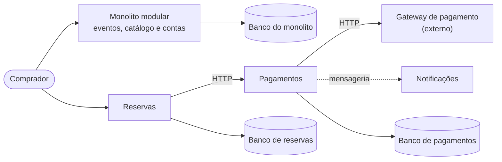

# Monolitos e Microsserviços

Guia de referência rápida sobre **dois estilos arquiteturais e os trade-offs entre eles**: o que caracteriza cada um, quando o monolito é a escolha mais sensata, os sinais de que ele saiu do controle e as propriedades de que um microsserviço depende para entregar a autonomia que promete.

> [!NOTE]
> Síntese pessoal, escrita com minhas palavras, de conceitos consolidados na literatura de arquitetura de software. As fontes estão nas [referências](#referências). Complementa o guia [Fundamentos de Arquitetura de Software](https://github.com/sidartaoss/fundamentos-arquitetura-software).

## Em resumo

- **Estilos, não estágios de maturidade.** Monolito não é sinônimo de legado; em muitos contextos, é a escolha padrão mais sensata.
- **A arquitetura reflete a organização.** Pela Lei de Conway, sistemas tendem a reproduzir a estrutura de comunicação de quem os projeta.
- **O problema é o acoplamento, não o tamanho.** Sem fronteiras internas, o monolito degenera em uma *Big Ball of Mud*, e cada mudança fica mais lenta, mais arriscada e mais cara.
- **Microsserviços são um conjunto de propriedades, não uma tecnologia.** Estado próprio, contratos estáveis, escopo coeso e implantação, escala e falhas independentes.
- **Distribuir tem preço.** Latência, consistência entre serviços, observabilidade e resiliência deixam de ser detalhes e passam a ser requisitos.

## 1. Dois estilos lado a lado

| Dimensão | Monolito | Microsserviços |
|---|---|---|
| Unidade de implantação | Um único artefato (JAR, WAR, binário) | Um artefato por serviço |
| Execução e comunicação | Um processo; chamadas de método | Um processo por serviço; chamadas via rede (HTTP, mensageria) |
| Dados | Um banco compartilhado por todos os módulos | Cada serviço é dono dos seus dados |
| Consistência | Transações ACID locais | Coordenação explícita entre serviços, em geral com consistência eventual |
| Escala | O sistema inteiro, vertical ou horizontalmente | Cada serviço, conforme a própria demanda |
| Falhas | Uma falha grave pode derrubar o processo inteiro | Podem ser contidas em um serviço, se houver design para isso |
| Tecnologia | Uma stack para todo o sistema | Uma stack por serviço |
| Times | Em geral, organizados por especialidade técnica | Organizados em torno de capacidades de negócio |
| Custo operacional | Baixo: uma aplicação para construir, testar e operar | Alto: automação, observabilidade e plataforma são pré-requisitos |

Entre os dois extremos está o **monolito modular**: uma única unidade de implantação, mas com fronteiras explícitas entre os módulos.

## 2. Monolito: quando é a escolha certa

> "Uma arquitetura monolítica é uma escolha, e uma escolha válida. Eu iria além: na minha opinião, é a escolha padrão sensata como estilo arquitetural." — Sam Newman

Martin Fowler chega à mesma conclusão por outro caminho: quase todos os casos bem-sucedidos de microsserviços que conheceu começaram como um monolito que cresceu demais e foi dividido, e quase todos os sistemas construídos como microsserviços desde o início acabaram em sérios problemas ([*MonolithFirst*](https://martinfowler.com/bliki/MonolithFirst.html)).

| O monolito ganha | E abre mão de |
|---|---|
| Simplicidade: um repositório, chamadas locais, depuração direta | Autonomia: todos os times coordenam mudanças sobre o mesmo código |
| Um único artefato para construir, testar de ponta a ponta e implantar | Implantação independente: qualquer mudança exige rebuild e redeploy completos |
| Transações ACID e consistência imediata em um único banco | Evolução independente dos dados: o esquema pertence a todos |
| Eficiência: sem latência nem falhas de rede entre componentes | Isolamento de falhas: um vazamento de memória em um módulo afeta todos |
| Escala horizontal simples, com mais instâncias do mesmo artefato | Escala seletiva: replica-se o sistema inteiro, ainda que só uma parte precise |
| Menor custo de infraestrutura e de operação | Liberdade tecnológica: uma única stack, difícil de atualizar quando envelhece |

Monolitos também convivem com outros estilos: é comum preservar o núcleo monolítico e extrair apenas as partes que têm uma razão concreta para sair.

## 3. A Lei de Conway

> "Organizações que projetam sistemas [...] são condicionadas a produzir designs que são cópias das estruturas de comunicação dessas organizações." — Melvin Conway (1968)

- Um único time, que coordena todas as mudanças sobre a mesma base de código, tende a produzir um monolito, sem que ninguém o tenha planejado.
- Grupos que trabalham isolados tendem a produzir componentes separados, com fronteiras que acompanham as da organização.
- A **manobra inversa de Conway** usa a lei a favor: estruturar os times de acordo com a arquitetura desejada, por exemplo, um time por capacidade de negócio.

A escolha entre monolito e microsserviços, portanto, não é apenas técnica: quando a organização muda, a arquitetura tende a acompanhá-la.

## 4. Quando o monolito sai do controle

O crescimento sem fronteiras internas conduz à *Big Ball of Mud* descrita por Brian Foote e Joseph Yoder: um sistema que ninguém compreende por inteiro. Chris Richardson chama esse estágio de *monolithic hell*. Os sinais costumam aparecer juntos:

| Área | Sinais |
|---|---|
| Código | Correções produzem efeitos colaterais inesperados; problemas só aparecem em produção |
| Produtividade | IDE, build, testes e inicialização lentos; onboarding demorado e dependente dos mais experientes |
| Entrega | Deploys raros, agendados e arriscados, com grandes lotes de mudança e rollback difícil |
| Times | Merges conflituosos e coordenação constante; nenhuma decisão técnica é local |
| Operação | Escala do sistema inteiro para atender uma única parte; uma falha em um módulo derruba todos |
| Tecnologia e dados | Stack obsoleta e difícil de atualizar; banco único inchado, com esquema frágil e disputa por recursos |

Esses sinais se agravam com o crescimento do sistema e do time. A resposta nem sempre é distribuir: modularizar o monolito costuma ser o primeiro passo.

## 5. Microsserviços: definição e propriedades

> "O estilo arquitetural de microsserviços é uma abordagem para desenvolver uma única aplicação como um conjunto de pequenos serviços, cada um executando em seu próprio processo e comunicando-se por mecanismos leves, frequentemente uma API HTTP." — James Lewis e Martin Fowler (2014)

Sam Newman resume de forma ainda mais curta: *pequenos serviços autônomos que trabalham juntos*. Nenhuma das definições menciona ferramentas: microsserviços são um conjunto de propriedades arquiteturais, e as tecnologias apenas as viabilizam.

| Propriedade | O que significa | O que a ameaça |
|---|---|---|
| **Estado próprio** | O banco é um detalhe interno, acessível apenas pela API do serviço (*database per service*) | Banco compartilhado, admissível só como exceção consciente, como em uma migração gradual |
| **Comunicação via rede** | APIs HTTP ou mensageria; cada serviço é uma caixa-preta (*information hiding*) | Acesso direto ao banco de outro serviço, contornando sua API |
| **Autonomia** | Evoluir e implantar sem coordenar com outros serviços | Quebra de contrato; bibliotecas compartilhadas com classes de domínio |
| **Escopo pequeno e coeso** | "Micro" diz respeito ao escopo, não às linhas de código: uma capacidade de negócio que um time pequeno compreende por inteiro | Fragmentação excessiva ou serviços grandes demais |
| **Flexibilidade tecnológica** | Linguagem e banco adequados a cada problema; experimentação de baixo risco | Heterogeneidade sem critério, que multiplica o custo de operação e de conhecimento |
| **Implantação independente** | Mudanças menores e mais frequentes; rollback localizado | Deploys coordenados entre serviços; ausência de automação |
| **Resiliência** | Falhas são inevitáveis e precisam ser contidas: *timeouts*, retentativas com *backoff*, *circuit breaker*, *bulkheads* | Cadeias de chamadas síncronas sem proteção, que propagam falhas em cascata |
| **Escalabilidade independente** | Instâncias e perfil de máquina definidos pela demanda de cada serviço, inclusive com escala automática | Gargalos compartilhados, como um banco único |

**Contratos.** Um contrato é a definição formal da interface de um serviço: endpoints, formatos e campos de entrada e de saída. A autonomia depende de contratos explícitos e estáveis; mudanças incompatíveis pedem uma nova versão da API, mantida em paralelo com a anterior até que os consumidores migrem. A comunicação assíncrona, quando possível, reduz ainda mais o acoplamento.

**Monolito distribuído.** Sam Newman usa o termo para sistemas com vários serviços que, por qualquer motivo, precisam ser implantados juntos. É o resultado típico de fronteiras mal traçadas e soma as desvantagens de um sistema distribuído às de um monolito.

## 6. O preço da distribuição

Martin Fowler chama de [*microservice premium*](https://martinfowler.com/bliki/MicroservicePremium.html) o custo e o risco adicionais que o estilo impõe (automação de deploy, monitoramento, tratamento de falhas, consistência eventual) e recomenda nem considerá-lo, a menos que o sistema seja complexo demais para ser gerenciado como monolito.

As falácias da computação distribuída, catalogadas na Sun Microsystems nos anos 1990 (a rede é confiável, a latência é zero, a largura de banda é infinita, entre outras), lembram que cada chamada de método convertida em chamada de rede passa a poder falhar, demorar ou ser repetida. Sem resiliência, observabilidade e automação, uma arquitetura de microsserviços pode se tornar **menos** robusta que o monolito que substituiu.

## 7. Exemplo aplicado: plataforma de venda de ingressos

A plataforma usada como exemplo no [guia de fundamentos](https://github.com/sidartaoss/fundamentos-arquitetura-software#7-exemplo-aplicado-plataforma-de-venda-de-ingressos) ajuda a visualizar a decisão. Em vez de dividir tudo, um ponto de partida comum é o monolito modular, do qual se extrai apenas o que tem uma pressão concreta para sair:

| Parte | Pressão concreta | Decisão | Trade-off |
|---|---|---|---|
| Eventos, catálogo e contas | Leitura intensa, mas carga previsível; evoluem junto com o produto | Permanecem no monolito modular, com cache no catálogo | Seguem acoplados entre si, o que é aceitável enquanto um único time os mantém |
| Reservas | Pico extremo na abertura das vendas; um assento não pode ser vendido duas vezes | Serviço próprio, escalado de forma independente | A consistência com pagamentos exige coordenação explícita, como reservas temporárias com expiração |
| Pagamentos | Dependência de gateways e de antifraude externos, sujeitos a lentidão e indisponibilidade | Serviço próprio, com *timeouts*, retentativas idempotentes e *circuit breaker* | Mais estados intermediários e conciliação para evitar cobranças duplicadas |
| Notificações | E-mail e *push* não podem bloquear a compra | Consumo assíncrono de eventos via mensageria | Entrega eventual; as filas precisam de monitoramento |

Cada extração só se justifica quando o ganho supera o preço da distribuição, e essa justificativa é exatamente o que um ADR deve registrar.

## Referências

- James Lewis e Martin Fowler — [Microservices](https://martinfowler.com/articles/microservices.html) (2014)
- Martin Fowler — [MonolithFirst](https://martinfowler.com/bliki/MonolithFirst.html) (2015), [Microservice Premium](https://martinfowler.com/bliki/MicroservicePremium.html) (2015), [Conway's Law](https://martinfowler.com/bliki/ConwaysLaw.html) (2022) e [Circuit Breaker](https://martinfowler.com/bliki/CircuitBreaker.html) (2014)
- Melvin Conway — [How Do Committees Invent?](https://www.melconway.com/Home/Committees_Paper.html) (*Datamation*, 1968)
- Brian Foote e Joseph Yoder — [Big Ball of Mud](http://www.laputan.org/mud/) (1997)
- David L. Parnas — *On the Criteria To Be Used in Decomposing Systems into Modules* (*Communications of the ACM*, 1972)
- Sam Newman — *Building Microservices*, 2ª ed. (O'Reilly, 2021) e *Monolith to Microservices* (O'Reilly, 2019)
- Chris Richardson — *Microservices Patterns* (Manning, 2018) e [microservices.io](https://microservices.io/)
- Michael T. Nygard — *Release It!*, 2ª ed. (Pragmatic Bookshelf, 2018)
